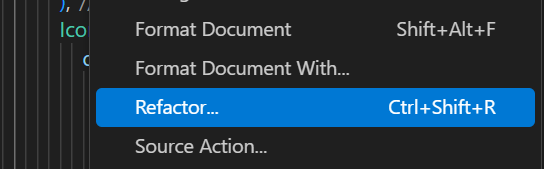
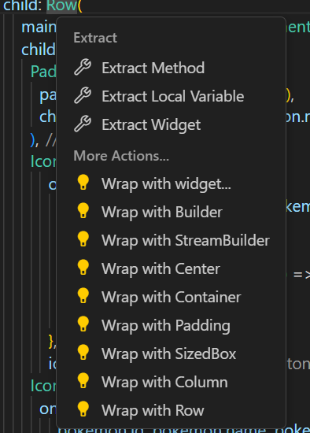

# Ohjelmistokehityksen teknologiat-kurssin seminaarityö: React native vs Flutter 

## Sisällysluettelo

### [1. Johdanto](#johdanto)
### [2. React Native](#react-native)
### [3. Flutter](#flutter)
### [4. Vertailu ja kehityskokemus](#vertailu)
### [5. Lähteet](#lähteet)


## Johdanto
Seminaarityön tavoitteena on tutustua Googlen kehittämään SDK Flutteriin ja tehdä mobiiliohjelmointi -kurssin
lopputyö uudelleen Flutterilla. 
Työssä vertaillaan Flutteria React Nativeen, jolla alkuperäinen sovellus on tehty. 
Raportti jäi hieman lyhyeksi, koska sovelluksen tekemisessä kesti pidempään, kun oletin.

Raportoin myös molempien kehitystyökalujen kehityskokemuksesta ja esittelen molempien hyötyjä sekä haittoja. 
Molempien sovellusten lähdekoodi löytyy tästä repositoriosta ja raportissa on kuvia sovelluksien 
käyttöliittymistä sekä lähdekoodeista.

Työn aikana perehdyin myös Flutterin käyttämään Dart-ohjelmointikieleen ja opin sen perusteet. 
Lähteistä löytyy linkki hyvään Flutter tutoriaaliin, joka auttaa ymmärtämään sen toimintatapaa ja käytäntöjä.


## React Native
React Native on Meta Industries Inc. (ent. Facebook Inc.) vuonna 2015 kehittämä avoimen lähdekoodin mobiilikehitysalusta.
React Native mahdollistaa natiivien mobiilisovellusten tekemisen hyödyntäen **JavaScriptiä** ja **React**-kirjastoa.
React Native on suosittu, koska sen avulla pystyy tekemään alustariippumattomia sovelluksia yhdellä koodipohjalla, mutta tarpeen tullessa voi myös tehdä natiivikohtaisia komponentteja.

Tämä sopii hyvin niille, jotka haluavat nopeuttaa mobiilikehitystä
ja minimoida resurssien tarpeen.

React Native on helppo opetella varsinkin, jos on aikaisemmin tehnyt ohjelmointia joko JavaScriptillä tai Reactilla.

Isoja hyötyjä React Nativessa ovat mielestäni Reactin **useState** ja **useEffect**-hookkien käyttäminen. useState-hookin ansiosta sovelluksen komponenttikohtainen tilanhallinta on erittäin helppoa ja voidaan välttää luokkapohjainen koodi kokonaan. Sen ansiosta koodi on helposti ylläpidettävää sekä helposti luettavaa.

useEffect-hook on erittäin hyödyllinen, koska hookin sisällä oleva koodi suoritetaan, kun komponentti renderöidään ensimmäisen kerran, ja tarvittaessa aina, kun riippuvuuslista muuttuu. Tämä tekee esimerkiksi API-kutsujen käytöstä helppoa.

Esimerkki useEffect-hookista, jonka avulla haetaan Pokemonit API:sta kun hookin sisältävä komponentti renderöidään. (Koko fetchPkmn funktio löytyy vertailu osiosta):

```javascript
useEffect(() => {
        fetchPkmn();
    }, []);
```

Itse olen tehnyt vain yksinkertaisia sovelluksia React Nativella mobiiliohjelmointi-kurssin yhteydessä, jolla opeteltiin React Native pohjaista mobiilikehitystä Expon avulla.

Lähdekoodi React Nativella tekemääni sovellukseen löytyy [täältä.](./ReactNative/)

React Native mobiilisovelluksia ovat mm. 
- Facebook
- Discord
- PS App
- Outlook
- Skype
- Tesla
- MS Teams


## Flutter
Flutter on Googlen vuonna 2018 julkaisema avoimen lähdekoodin UI-kehys, jonka avulla yhdellä koodipohjalla voi rakentaa sovelluksia monille eri alustoille kuten ,Android, iOS, Web, macOS ja Linux.

Flutterin perustana toimivat sen tarjoamat valmiit Widgetit, joiden ansiosta tarkan ja responsiivisen käyttöliittymän rakentaminen on helppoa. Widgetit ovat Flutter sovelluksen ns. komponentteja.

Widgettejä yhdistelemällä on helppo luoda monimutkaisia käyttöliittymiä.
Flutter käyttää Googlen kehittämää ohjelmointikieltä **Dart**:ia, joka kehitettiin vaihtoehdoksi JavaScriptille.

Flutter tarjoaa myös hyvän ominaisuuden Dart DevTools:issa, jossa on mm. Widget inspector, jolla näkee yksityiskohtaisia tietoja widgeteistä ja niiden toiminnasta.

Flutterilla on erittäin hyödyllinen ominaisuus refaktoroida koodia ilman, että tarvitsee itse alkaa kirjoittamaan koko osiota.

<details>
<summary><strong>Näytä kuvat</strong></summary>




</details>


Esimerkki komponenttien (widgettien) yhdistelystä HomePage-luokan widgetin body osiosta:

<details>
<summary><strong>Näytä koodipätkä</strong></summary>

```dart
    body: <Widget>[
            Scaffold(
            appBar: AppBar(title: Text("Pokemon info")),
            body: Center(
                child: Column(
                mainAxisAlignment: MainAxisAlignment.center,
                children: [
                    LoginDialog(),
                    SizedBox(
                    height: 15,
                    ),
                    Text("Don't have an account? Create one now!"),
                    SizedBox(
                    height: 10,
                    ),
                    RegisterDialog()
                ],
                ),
            ),
            ),
            ListPage(),
            FavoritesPage(),
            SettingsPage(),
        ][selectedIndex],
```
</details>

Ennen seminaarityön aloittamista en ollut tehnyt mitään ohjelmointia Flutterilla tai Dartilla.

Lähdekoodi Flutterilla tekemääni sovellukseen löytyy [täältä.](./Flutter/pokemon_info_mobile/)

Flutter mobiilisovelluksia ovat mm. 
- Googlen sovellukset (esim. Google pay, -classroom, -ads)
- eBay Motors
- MyBMW App
- Philips Hue
- Nubank
- Dream11
- Realtor.com


## Vertailu
Molemmissa on mielestäni sekä hyviä ja huonoja puolia.  JSON-datan käsittely oli huomattavasti helpompaa React Nativessa, kun taas elementtien siirtely ja muotoilu on mielestäni paljon yksinkertaisempaa Flutterissa.

#### Firebase
React Nativea ja Flutteria yhdistää ainakin se, että Firebasen kanssa sai painia ihan tosissaan. Se oli vaikeaa molemmissa, mutta eri syiden takia.

React Nativen kanssa Firebaseen yhdistäminen oli vaikeaa, koska silloin, kun yhdistin alkuperäisen sovelluksen Firebaseen ja tietokantaan niiden dokumentaatio oli täyttä kuraa. Nyt Firebase on onneksi päivittänyt dokumentaationsa, joka näyttää paljon selkeämmältä oppaalta.

Flutterin kanssa vaikeuksia tuottivat odottamattomat virheilmoitukset, joita ei mainittu Firebasen dokumentaatiossa. Näitä virheitä tuli, vaikka seurasi dokumentaatiota uskonnollisesti ja
tämä hidasti etenemistä huomattavasti.

Kun yhdistäminen onnistui pystyi käyttämään Firebasea ja sen tietokantaa sovelluksessa.

React Nativessa joutui käydä tekemässä projektin firebase-konsoliin ja sieltä sai tarvittavat tiedot Firebasen yhdistämiseen ja käyttöönottoon.

<details>
<summary><strong>React Native Firebase config</strong></summary>
persistence ReactNativeAsync storage tarvittiin, jotta kirjautuminen ja käyttäjäkohtainen renderöinti toimi oikein.

```javascript
        const firebaseConfig = {
        apiKey: API_KEY,
        authDomain: AUTH_DOMAIN,
        databaseURL: DB_URL,
        projectId: PROJECT_ID,
        storageBucket: STORAGE_BUCKET,
        messagingSenderId: MSG_SENDER_ID,
        appId: APP_ID,
        measurementId: MEASUREMENT_ID,
        };

        const app = initializeApp(firebaseConfig);
        export const database = getDatabase(app);
        export const auth = initializeAuth(app, {
        persistence: getReactNativePersistence(ReactNativeAsyncStorage)
        }); 
```
</details>

Flutterissa on hyvät integraatiot projektin luomiseen ja linkittämiseen FlutterFire CLI ohjelmistolla.  Linkitys tapahtui kirjautumalla Firebaseen FlutterFIren kautta ja sitten valittiin joko uusi tai olemassa oleva projekti, johon Flutter sovellus liitetään.

Tämän onnistuessa FlutterFire generoi sinulle google-services.json, firebase.json ja firebase_options.dart tiedostot, joissa on tarvittavat tiedot Firebasen käyttämiseen (tiedot kuten yllä olevassa React Nativen esimerkissä).

Viimeinen osa joka täytyy tehdä on liittää Firebase sovelluksesi juureen main.dart tiedostossa:

```dart
    void main() async {
  WidgetsFlutterBinding.ensureInitialized();
  await Firebase.initializeApp(
    options: DefaultFirebaseOptions.currentPlatform,
  );
  runApp(const MyApp());
}
```


#### Tietokanta
Ainoa tietokantaoperaatio, jonka kanssa oli ongelmia oli datan poistaminen.
Dokumentaatiossa ei ollut kunnon esimerkkiä ja siellä luki, että yleisin tapa poistaa dataa on remove() metodilla. Mutta ei kerrottu, että miten kyseistä metodia käytetään, jonka takia toiminnallisuuden saavuttaminen vei hieman aikaa.

React Nativessa remove() metodia käytetään esim. näin:
<details>
<summary><strong>Näytä koodi</strong></summary>
Tietokantaan on tallennettu itemeitä käyttäjäkohtaisesti, joten joudumme katsomaan nykyisen käyttäjän currentUser tarkistuksen avulla.
Data on tietokennassa tallennettu näin:
users -> uid -> item id key -> item id, item name, item url 

```javascript
    const deleteFavourite = (itemId) => {
        const user = auth.currentUser
        Alert.alert(
            'Delete Confirmation',
            'Are you sure you want to delete this favourite?',
            [
                {
                    text: 'Cancel',
                    style: 'cancel',
                },
                {
                    text: 'Delete',
                    onPress: () => {
                        remove(ref(database, `users/${user.uid}/${itemId}`));
                        alert("Favourite removed.");
                    },
                    style: 'destructive',
                },
            ],
            { cancelable: true }
        );
    };
```
</details>

Flutterissa poisto tapahtuu myös remove() metodilla, mutta hieman eri tavalla:

```dart
    var user = FirebaseAuth.instance.currentUser;
    DatabaseReference removeRef = FirebaseDatabase.instance.ref();
    await removeRef.child('users/${user.uid}/$key').remove();
```

#### Käyttöliittymä/UI
En ehtinyt käyttää paljoa aikaa käyttöliittymien siistimiseen, koska seminaarityön deadline painoi niskaan, mutta Flutterin muokkaamaton käyttöliittymä on mielestäni paremman näköinen kuin React Nativessa. Se vaikuttaa jotenkin vain paremmalta ja sitä on helpompi muokata. Esim. Buttoneiden ulkonäköä ei tarvitse säätää style-attribuuteilla tai variant-attribuutilla. Voi valita vain halutun button tyypin (Elevated-, text-, outlined-, icon-, floatingAction-, dropDown- ja popupMenuButton).

Nappeja ei ehkä voi tyylitellä yhtä hyvin kuin React Nativessa, mutta se sopii minulle, koska en jaksa veivata miljoonaa eri attribuuttia, jotta saan napin näyttämään hyvältä.

<details>
<summary><strong>Näytä kuvia käyttöliittymistä</strong></summary>
TODO: add images
</details>


#### Kehityskokemus
Sekä Flutter että React Native olivat ihan hyviä kehittämiskokemuksen kannalta, mutta molemmissa on omia hyötyjä ja haittoja.

JSON-datan käsittely oli paljon helpompaa React Nativessa kuin Flutterissa. Myös tietokannasta haettu data oli helpompi saada toimimaan React Nativen puolella. Piti vain hakea data, laittaa se mappiin ja sitten laittaa mappi tilamuuttujaan, jonka avulla ne näytetään sovelluksessa.

<details>
<summary><strong>React Native JSON käsittely</strong></summary>

#### API haku


#### Tietokantahaku


</details>

Flutterissa dataa haettaessa ensin pitää luoda luokka, joka määrittelee haettavan datan rakenteen. Data haetaan verkosta HTTP-pyynnöllä (API haku, tietokantahaussa haetaan firebasen get() metodilla) ja JSON vastauksen data dekoodataan Dartin Map-olioksi. Tämän jälkeen jokainen JSON-objekti muunnetaan factory-metodilla olioksi ja sitten olioiden lista välitetään sovellukselle AppStaten kautta.

<details>
<summary><strong>Flutter/Dart JSON käsittely</strong></summary>

#### Pokemon luokka


#### API halu


#### Appstate, josta sovellus saa listan


#### Favorite pokemon luokka


#### Tietokantahaku


</details>

Flutter voittaa React Nativen elementtien tyylittelyssä sekä liikuttamisessa. 
Ei tarvitse antaa elementeille "style" attribuuttia vaan voi wrap refaktoroinnilla vain määritellä miten widget näytetään sovelluksessa, kuten [Flutter](#flutter) kohdassa mainitaan. 

Ainakin itselleni tyylittely oli paljon helpompaa Flutterissa. 
Ei tarvinnut repiä hiuksia päästä, kun yritti asettaa elementtejä keskelle näyttöjä ja sopiville etäisyyksille toisistaan. Painoi vaan esim. "refactor -> wrap with center" ja Flutter keskitti halutun widgetin.

React Nativen koodirakenne on mielestäni taas paljon parempi kuin Flutterissa. Flutterin koodi on pitkää pötköä ja varmaan isoimmissa sovelluksessa yhden komponentin koodi on erittäin pitkä. Itselleni on helpompaa lukea React Native koodia, mutta ehkä se johtuu siitä, että olen käyttänyt JavaScriptiä/Reactia enemmän kuin Flutteria/Dartia.

Tässä molempien sovellusten UI:ssa näytettävä pokemon lista osio:

<details>
<summary><strong>React Native koodirakenne</strong></summary>

```javascript
        renderItem = ({ item }) => (
        <ListItem bottomDivider>
            <ListItem.Content style={styles.list} >
                <ListItem.Title style={{ fontSize: 25 }}>{textFormat(item.name)}</ListItem.Title>
                <Icon
                    name='info'
                    onPress={() => navigation.navigate('Pokemon Data', { pokemon: item })}
                    color={'white'}
                    size={30}
                />
                <Icon
                    name='star'
                    onPress={() => addFavourite(item)}
                    color={'yellow'}
                    size={31}
                />
            </ListItem.Content>
        </ListItem>)

    if (loading) {
        return (
            <View style={styles.container}>
                <ActivityIndicator size={'large'} />
            </View>
        )
    } else {
        return (
            <View style={styles.container}>
                <FlatList
                    keyExtractor={item => item.pkmnId}
                    renderItem={renderItem}
                    data={keyword === "" ? pokemon : filtered}
                    pagingEnabled={true}
                    disableVirtualization={false}
                    ListHeaderComponent={
                        <TextInput
                            style={{ height: 40, borderColor: 'gray', borderWidth: 1, margin: 10, paddingHorizontal: 10, backgroundColor: '#fff' }}
                            placeholder='Search...'
                            onChangeText={text => setKeyword(text)}
                            value={keyword}
                        />}
                />
            </View>
        )
    }
}
```
</details>

<details>
<summary><strong>Flutter koodirakenne</strong></summary>

```dart
    class ListPage extends StatelessWidget {
  @override
  Widget build(BuildContext context) {
    var appState = context.watch<AppState>();
    return Scaffold(
        appBar: AppBar(title: Text("Pokemon list")),
        body: appState.isLoading
            ? const Center(
                child: CircularProgressIndicator(),
              )
            : ListView.builder(
                itemBuilder: (context, index) {
                  final pokemon = appState.pokemonList[index];
                  return Container(
                    decoration: BoxDecoration(
                        border:
                            Border.all(color: Colors.greenAccent, width: 2.0),
                        borderRadius: BorderRadius.circular(8.0)),
                    child: Row(
                        mainAxisAlignment: MainAxisAlignment.center,
                        children: <Widget>[
                          Padding(
                            padding: const EdgeInsets.all(16.0),
                            child: Text(nameFormat('${pokemon.name} ')),
                          ),
                          IconButton(
                              onPressed: () async {
                                appState.loadPokemonData(pokemon.id);
                                showDialog(
                                  context: context,
                                  builder: (BuildContext context) =>
                                      DataDialog(),
                                );
                              },
                              icon: Icon(Icons.info)),
                          IconButton(
                            onPressed: () => addFavorite(
                                pokemon.id, pokemon.name, pokemon.pkmnLink),
                            icon: Icon(
                              appState.favList
                                      .any((fav) => fav.id == pokemon.id)
                                  ? Icons.star
                                  : Icons.star_border,
                              color: Colors.yellow,
                            ),
                          )
                        ]),
                  );
                },
              ));
  }
}
```
</details>

Flutterin yksinkertaisuus ja modulaarisuus on hyvä puoli, koska se helpottaa luettavuutta varsinkin isoimmissa projekteissa. 

Jaettujen tiedostojen käyttö Flutterissa on kätevämpää kuin React Nativessa, koska Flutter hyödyntää Dartin sisäänrakennettua pakettijärjestelmää, joka mahdollistaa selkeämmän tavan jakaa ja uudelleenkäyttää koodia. Dartissa voit helposti tuoda kokonaisia tiedostoja ja niiden sisältöä importilla ilman, että tarvitsee määritellä yksittäisten komponenttien exportteja.

Navigaation tekeminen on mielestäni helpompaa Flutterilla kuin React Nativella, koska Flutter tarjoaa sisäänrakennetun Navigator-luokan ja sitä on helppo käyttää. React Nativen navigaatiossa tuli paljon enemmän ongelmia vastaan varsinkin, kun piti syötellä propseja komponenttien välillä. 

Kaiken kaikkiaan molemmat React Native ja Flutter ovat aika helposti opittavissa olevia ohjelmointikieliä/frameworkkejä yksinkertaisten mobiilisovellusten tekemiseen. Jos on aikaisemmin käyttänyt JavaScriptiä/Reactia niin kannattaa valita React Native. Jos on aikaisemmin käyttänyt Dartia niin Flutter on parempi valinta.

Jos et ole käyttänyt kumpaakaan niin heitä kolikkoa tai käy selailemassa molempien dokumentaatiota lähteissä olevista linkeistä ja päätä kumpi vaikuttaa paremmalta.

## Lähteet
- React native documentation: [https://reactnative.dev/](https://reactnative.dev/) 
- Flutter documentation: [https://flutter.dev/](https://flutter.dev/)
- First Flutter app tutorial: [https://docs.flutter.dev/get-started/codelab](https://docs.flutter.dev/get-started/codelab)
- Dart documentation: [https://dart.dev/](https://dart.dev/)
- Geeks for Geeks Flutter API tutorial: [https://www.geeksforgeeks.org/flutter-fetch-data-from-rest-apis/](https://www.geeksforgeeks.org/flutter-fetch-data-from-rest-apis/)
- Firebase documentation: [https://firebase.google.com/docs](https://firebase.google.com/docs)


[Back to top](#ohjelmistokehityksen-teknologiat-kurssin-seminaarityö-react-native-vs-flutter)